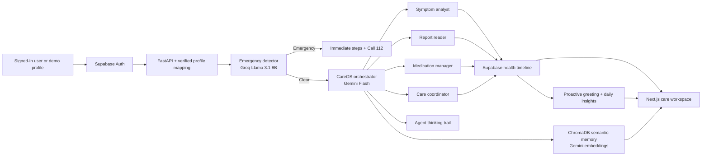
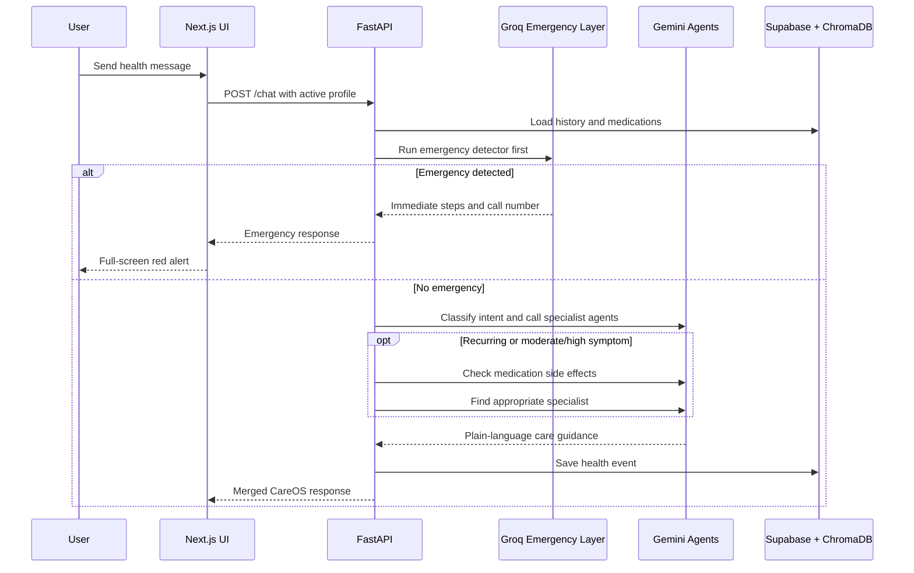

# CareOS

CareOS is an emergency-first, multi-agent healthcare companion for Indian
families. It turns scattered symptoms, medications, lab reports, and family
health context into clear next steps and a doctor-ready care brief.

> CareOS is an informational hackathon prototype, not a diagnosis or medical
> device. For urgent symptoms, call local emergency services immediately.



## Problem Statement

People often manage health information across prescriptions, PDFs, chat
messages, and memory. That fragmentation makes it harder to recognize urgent
symptoms, understand reports, avoid medication mistakes, and explain recent
history during a short doctor visit.

CareOS gives each person and family member one simple care workspace backed by
specialist AI agents and a shared health timeline.

## Current Stage

**Stage 5 plus the proactive companion upgrade is complete. The end-to-end
hackathon MVP is ready for demonstration.**

- Supabase database layer for users, family, events, medications, and reports
- Emergency-first orchestrator with five specialist agents
- FastAPI routes for chat, reports, medications, family, history, and briefs
- Responsive Next.js interface with voice-enabled chat and emergency overlay
- Report, medication, family, and profile workflows
- Repeatable Ramesh Gupta demo dataset, loading states, error handling, and tests
- Indian-accent Hindi/English gTTS output with Hindi/English speech input
- Proactive greetings, daily insight cards, and unresolved-symptom follow-ups
- Visible multi-agent thinking trail and autonomous medication/specialist checks
- OPQRST/OLD CART guided symptom follow-ups and cautious differential reasoning
- Strict owner/family-member context isolation across UI, Supabase, and ChromaDB
- Automatic CareOS voice replies and delayed hands-free voice-message sending
- Supabase email/password sign-up, sign-in, persistent sessions, and sign-out
- Verified Auth UUID to isolated CareOS profile mapping, with the Ramesh demo preserved
- Profile-scoped persistent chat history with context-aware multi-message follow-ups
- Consistent Lucide insight icons instead of provider-specific emoji shortcodes

### Build Progress

| Stage | Scope | Status |
| --- | --- | --- |
| 1 | Supabase database access layer | Complete |
| 2 | Database-wired orchestrator and FastAPI routes | Complete |
| 3 | Core layout, chat, voice input, and emergency UI | Complete |
| 4 | Reports, medications, family, and profile screens | Complete |
| 5 | Demo data, interface polish, tests, and documentation | Complete |
| Companion upgrade | gTTS, proactive greeting, agent trail, follow-up loop, daily digest | Complete |
| Family isolation | Profile-scoped chat, memory, medications, reports, insights, and timelines | Complete |
| Account access | Supabase Auth sign-up, sign-in, session persistence, profile mapping, and sign-out | Complete |

## Five-Agent Architecture



The emergency detector runs before all other agents on every chat message.
Gemini handles the main reasoning, PDF understanding, and semantic embeddings.
Groq handles the speed-sensitive emergency layer and fast fallback responses.

## Memory And Family Profiles

CareOS retains health-condition context rather than restoring a word-for-word
chat transcript. Healthcare messages are saved as profile-scoped Supabase
`health_events`, while ChromaDB stores semantic memories for later symptom
analysis. Casual small talk is intentionally not persisted.

Every family member has an isolated context. Selecting a family profile switches
the chat, greeting, daily digest, health timeline, reports, medications, doctor
brief, new health events, and ChromaDB memory namespace to that person. In-flight
requests from the previously selected profile are cancelled or ignored, so an
owner medication such as Ramesh's Metformin cannot appear in Sita's view.

Supabase Auth identities use UUIDs while the existing CareOS schema uses bigint
profile IDs. `POST /auth/profile` verifies the Supabase access token, then safely
resolves or creates the matching CareOS owner profile. The service-role key
remains backend-only; the frontend receives only the public Supabase anon key.

## Request Flow



## Tech Stack

| Layer | Technology |
| --- | --- |
| Frontend | Next.js 16, React 19, TypeScript, Tailwind CSS, Axios, Lucide |
| Backend | Python, FastAPI, Pydantic, Uvicorn |
| AI brain and PDF vision | Google Gemini Flash |
| Emergency speed layer | Groq Llama 3.1 8B Instant |
| Semantic memory | ChromaDB with Gemini embeddings |
| Database and report storage | Supabase Postgres and Storage |
| PDF output | ReportLab |
| Voice output | gTTS streaming MP3 with Indian English/Hindi accent |
| Voice input | Browser Web Speech API (`en-IN` / `hi-IN`) |
| Deployment targets | Vercel frontend, Railway/Render backend |

## Project Structure

```text
agents/          Five specialist agent implementations
backend/app/     FastAPI, schemas, services, and Supabase database layer
backend/tests/   Database, API, and orchestration tests
docs/            CareOS architecture diagram
frontend/        Next.js care workspace
memory/          ChromaDB semantic-memory adapter
api.py           Deployment-friendly FastAPI entrypoint
seed_data.py     Repeatable Supabase demo dataset
```

## Local Setup

### 1. Configure credentials

Copy `.env.example` to `.env`, then paste the keys into these fields:

```env
GEMINI_API_KEY=your_gemini_api_key
GROQ_API_KEY=your_groq_api_key
SUPABASE_URL=your_supabase_project_url
SUPABASE_KEY=your_supabase_service_role_key
NEXT_PUBLIC_API_URL=http://localhost:8000
NEXT_PUBLIC_SUPABASE_URL=your_supabase_project_url
NEXT_PUBLIC_SUPABASE_PUBLISHABLE_KEY=your_supabase_publishable_key
```

The backend must use the Supabase **service role** key. Never expose that key in
the frontend or commit `.env`. Put the two `NEXT_PUBLIC_...` values in
`frontend/.env.local`; the anon key is safe for browser authentication, but the
service-role key is not.

For Vercel, local `.env.local` files are not uploaded. Add
`NEXT_PUBLIC_API_URL`, `NEXT_PUBLIC_SUPABASE_URL`, and
`NEXT_PUBLIC_SUPABASE_PUBLISHABLE_KEY` under **Project Settings → Environment
Variables** for Production, Preview, and Development, then redeploy. CareOS
also accepts the legacy `NEXT_PUBLIC_SUPABASE_ANON_KEY` name. Do not commit a
`.env.production` file: it can silently force every Vercel build to use an old
or unrelated backend URL.

The current hackathon deployment also includes browser-safe fallbacks for its
public Supabase publishable credentials and Render API URL. Private service-role
and AI provider keys remain backend-only.

Create a public Supabase Storage bucket named `reports`. The database expects
the five tables described by the project architecture: `users`,
`family_members`, `health_events`, `medications`, and `reports`.

Run [`supabase_schema_fix.sql`](supabase_schema_fix.sql) once in the Supabase SQL
editor. It fixes the live project's misspelled health-event foreign key and
allows owner records without requiring a family member. It also adds the
`auth_user_id` and `email` fields required to map Supabase Auth accounts to
CareOS profiles. Enable Email authentication in Supabase Authentication; email
confirmation may be enabled or disabled depending on the desired demo flow.

### 2. Install and run the backend

```powershell
py -m venv .venv
.\.venv\Scripts\Activate.ps1
pip install -r backend\requirements.txt
python seed_data.py
uvicorn backend.app.main:app --reload
```

API docs are available at `http://localhost:8000/docs`.

### 3. Install and run the frontend

```powershell
cd frontend
npm install
npm run dev
```

Open `http://localhost:3000`.

The first screen supports sign-in, account creation, and a one-click Ramesh demo
path. Signed-in sessions persist through refreshes. Use the sign-out icon beside
the active profile name to return to the account screen.

## Deploy Backend On Render

The repository includes [`render.yaml`](render.yaml). In Render, create a new
**Blueprint** from this repository, or configure a Web Service with:

```text
Build command: pip install -r backend/requirements.txt
Start command: uvicorn backend.app.main:app --host 0.0.0.0 --port $PORT
Health check path: /health
```

Do not use `--reload` on Render. Add `GEMINI_API_KEY`, `GROQ_API_KEY`,
`SUPABASE_URL`, and the backend-only Supabase service-role `SUPABASE_KEY` as
Render environment variables. Set `CAREOS_ALLOWED_ORIGINS` to the deployed
frontend URL, for example `https://careos.vercel.app`.

After deployment, set the frontend environment variable
`NEXT_PUBLIC_API_URL=https://your-careos-service.onrender.com` and redeploy the
frontend.

## Demo Dataset

`python seed_data.py` safely upserts a realistic owner profile:

- **Ramesh Gupta**, 52, living with type 2 diabetes and hypertension
- Five health events spread across the previous three months
- Two lab reports showing an improving HbA1c and fasting glucose trend
- Four active medications with dose, frequency, timing, and food guidance

The deterministic demo user ID is `9000001`, matching the frontend demo
profile and the live Supabase project's `bigint` identifiers.

## How To Demo

1. Create a new account or choose **Continue with Ramesh demo**.
2. Start on **Chat** and ask: `I have mild tingling in both feet at night.`
3. Show that CareOS uses Ramesh's existing diabetes history and routes the
   message to the symptom analyst.
4. Ask: `I have crushing chest pain and difficulty breathing.` Show the
   emergency-first red alert and prominent `Call 112` action.
5. Open **Reports**, expand both seeded reports, and highlight the improving
   HbA1c trend. Upload a PDF to demonstrate Gemini report reading.
6. Open **Medications**, review the four active medicines, then check an
   interaction before adding a new medicine.
7. Open **Family** to add or switch a dependent profile.
   Show that switching to Sita clears Ramesh's chat and medication insights and
   loads only Sita's profile-scoped health context.
7. Open **Profile** and download the doctor visit brief.
8. Refresh Chat to hear CareOS speak first, then select **हिंदी** to show the
   Hindi greeting, Hindi chat, and Hindi voice output.
9. Ask `My headache is happening again and getting worse` to show the animated
   symptom, medication, and specialist agent trail.
10. Answer an unresolved-symptom greeting with `better now` to show CareOS
    closing the follow-up loop.
11. Tap a daily insight card to send it directly into the conversation.

## Main API Routes

| Route | Purpose |
| --- | --- |
| `POST /chat` | Emergency-first agent orchestration |
| `GET /greeting/{user_id}` | Generate a contextual proactive greeting |
| `GET /daily-digest/{user_id}` | Generate today's health insight cards |
| `POST /text-to-speech` | Stream Hindi or English CareOS speech as MP3 |
| `POST /upload-report` | Store and analyze a PDF report |
| `GET /reports/{user_id}` | List report history |
| `POST /medications/check-interactions` | Check a new drug against active medicines |
| `POST /medications/add` | Add an active medication |
| `POST /family/add` | Add a dependent profile |
| `GET /history/{user_id}` | Return the health event timeline |
| `GET /doctor-brief/{user_id}` | Generate a doctor visit brief |
| `GET /api/care-brief/{profile_id}/pdf` | Download the brief as PDF |

## Verification

```powershell
.\.venv\Scripts\python.exe -m pytest -q backend\tests
cd frontend
npm run lint
npm run build
```

Current automated verification: **38 backend tests passing**, frontend lint
and TypeScript checks passing.

## What Is Already Done

- Gemini/Groq provider routing with emergency-first orchestration
- Five focused healthcare agents and multi-intent routing
- User and family-member scoped Supabase health records
- Semantic health-memory retrieval through ChromaDB
- Gemini PDF report analysis with report history comparison
- Medication creation and AI interaction checks
- Downloadable doctor visit brief
- Mobile-first five-tab frontend with voice input and emergency overlay
- Hindi/English gTTS voice output and language-aware chat
- Proactive contextual greeting that speaks first
- Autonomous symptom-to-medication-to-specialist agent chain
- Follow-up memory loop that resolves the originating health event
- OPQRST/OLD CART symptom assessment for new and ongoing complaints
- Daily medication, trend, follow-up, and report insight cards
- Strict family-profile data isolation with stale-request protection
- Live Supabase-compatible demo seed and schema migration
- Loading, empty, progress, and error states across primary workflows
- Backend API/database tests and frontend production verification

### Before Real Users

- Add Supabase Auth and remove the hard-coded demo user
- Enable and test row-level security for every table and storage object
- Add explicit consent, data deletion, and emergency-contact notification flows
- Encrypt sensitive fields and define retention and audit-log policies
- Add clinician-reviewed prompt evaluations and emergency false-negative tests
- Add server-scheduled push/SMS medication reminder delivery
- Add observability, rate limits, provider-failure monitoring, and retries
- Complete clinical, privacy, security, and regulatory review

## Safety and Production Gaps

Before real-world use, CareOS would require authentication, row-level security,
encryption and retention policies, clinical validation, audit logging, consent
flows, monitoring, and regulatory/privacy review.
