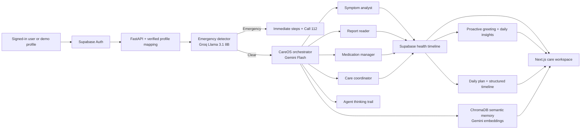
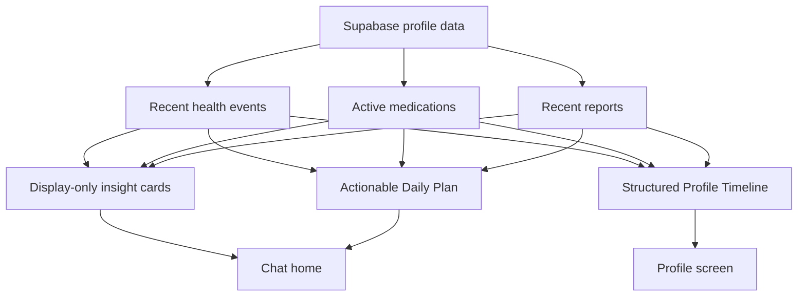
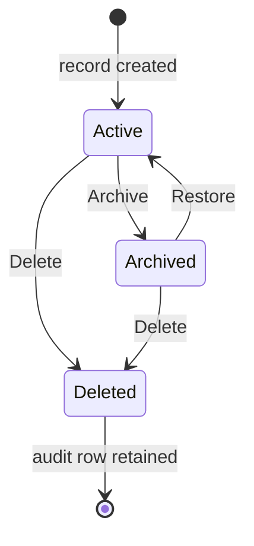
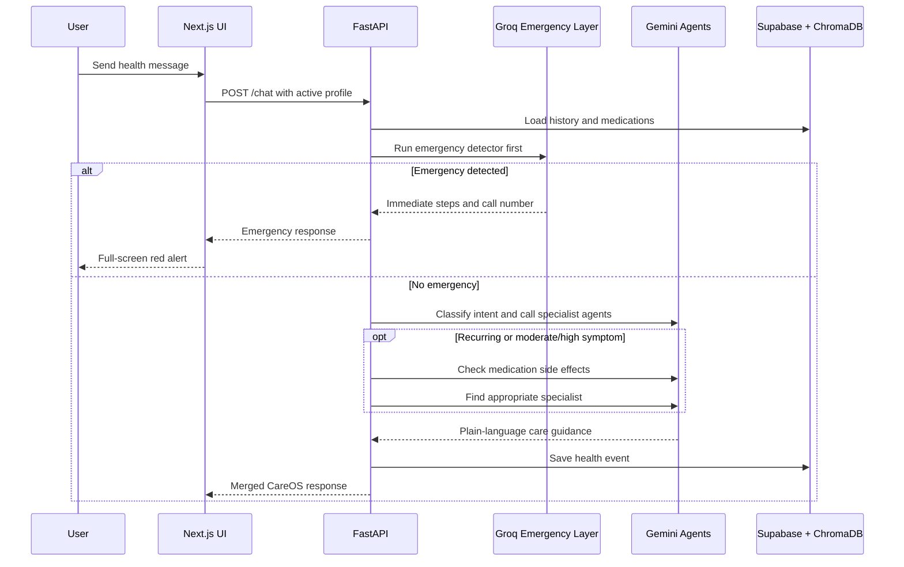

# CareOS

CareOS is an emergency-first, multi-agent healthcare companion for Indian
families. It turns scattered symptoms, medications, lab reports, and family
health context into clear next steps and a doctor-ready care brief.

> CareOS is an informational hackathon prototype, not a diagnosis or medical
> device. For urgent symptoms, call local emergency services immediately.



## Problem Statement

People often manage health information across prescriptions, PDFs, chat
messages, and memory. That fragmentation makes it harder to recognize urgent
symptoms, understand reports, avoid medication mistakes, and explain recent
history during a short doctor visit.

CareOS gives each person and family member one simple care workspace backed by
specialist AI agents and a shared health timeline.

## Current Stage

**Stage 5, the proactive companion upgrade, and the Round 2 data-lifecycle
and trust layer are all complete. The end-to-end hackathon MVP is ready for
demonstration.**

- Supabase database layer for users, family, events, medications, and reports
- Emergency-first orchestrator with five specialist agents
- FastAPI routes for chat, reports, medications, family, history, and briefs
- Responsive Next.js interface with voice-enabled chat and emergency overlay
- Report, medication, family, and profile workflows
- Repeatable Ramesh Gupta demo dataset, loading states, error handling, and tests
- Indian-accent Hindi/English gTTS output with Hindi/English speech input
- Proactive greetings, daily insight cards, and unresolved-symptom follow-ups
- Visible multi-agent thinking trail and autonomous medication/specialist checks
- OPQRST/OLD CART guided symptom follow-ups and cautious differential reasoning
- Strict owner/family-member context isolation across UI, Supabase, and ChromaDB
- Automatic CareOS voice replies and delayed hands-free voice-message sending
- Supabase email/password sign-up, sign-in, persistent sessions, and sign-out
- Verified Auth UUID to isolated CareOS profile mapping, with the Ramesh demo preserved
- Profile-scoped persistent chat history with context-aware multi-message follow-ups
- Consistent Lucide insight icons instead of provider-specific emoji shortcodes
- Display-only three-card health summary on Chat: latest concern, avoid/do steps, quick summary
- Actionable CareOS Daily Plan cards backed by medications, unresolved symptoms, and reports
- Structured Profile timeline that merges symptoms, medications, and reports into one view
- Archive / restore / delete lifecycle for health events, reports, medications, and family members
- Centralized Data Control tab: retention summary, lifecycle tree + stacked-bar charts, per-record actions, audit log
- Consent + Data Confidence chips showing storage state and AI-context usage on every record
- Trust Timeline merging symptoms, reports, medications, and lifecycle actions into one chronological view
- AI Context Transparency panel showing exactly what fed a chat reply and what archived data was excluded
- One-click guided demo scenario that drives the archive → restore → delete flow end to end
- Centralized English/Hindi translation layer covering navigation, screen chrome, and lifecycle UI
- Punctuation-safe, faster CareOS voice output (no spoken `*`/`!`, ~15% quicker playback)

### Build Progress

| Stage | Scope | Status |
| --- | --- | --- |
| 1 | Supabase database access layer | Complete |
| 2 | Database-wired orchestrator and FastAPI routes | Complete |
| 3 | Core layout, chat, voice input, and emergency UI | Complete |
| 4 | Reports, medications, family, and profile screens | Complete |
| 5 | Demo data, interface polish, tests, and documentation | Complete |
| Companion upgrade | gTTS, proactive greeting, agent trail, follow-up loop, daily digest | Complete |
| Family isolation | Profile-scoped chat, memory, medications, reports, insights, daily plan, and timelines | Complete |
| Account access | Supabase Auth sign-up, sign-in, session persistence, profile mapping, and sign-out | Complete |
| Standout layer | Daily plan, display-only insight cards, structured health timeline, report dashboard | Complete |
| Round 2: Data lifecycle | Archive/restore/delete, Data Control tab, retention audit log | Complete |
| Round 2: Trust layer | Consent chips, Trust Timeline, AI Context Transparency, one-click demo | Complete |
| Round 2: Family lifecycle | Archive/restore/delete for dependent profiles | Complete |
| Round 2: Visualization | Lifecycle tree view + validated status-palette stacked-bar charts | Complete |
| Round 2: i18n & voice polish | EN/HI UI translation layer, punctuation-safe TTS, faster playback | Complete |

## Five-Agent Architecture


```mermaid
flowchart LR
    U["Signed-in user or demo profile"] --> AUTH["Supabase Auth"]
    AUTH --> API["FastAPI + verified profile mapping"]
    API --> E["Emergency detector<br/>Groq Llama 3.1 8B"]
    E -->|Emergency| ALERT["Immediate steps + Call 112"]
    E -->|Clear| O["CareOS orchestrator<br/>Gemini Flash"]
    O --> S["Symptom analyst"]
    O --> R["Report reader"]
    O --> M["Medication manager"]
    O --> C["Care coordinator"]
    O --> TRAIL["Agent thinking trail"]
    S & R & M & C --> DB["Supabase health timeline"]
    O --> MEM["ChromaDB semantic memory<br/>Gemini embeddings"]
    DB & MEM --> UI["Next.js care workspace"]
    DB --> PRO["Proactive greeting + daily insights"]
    DB --> PLAN["Daily plan + structured timeline"]
    PRO --> UI
    PLAN --> UI
```

The emergency detector runs before all other agents on every chat message.
Gemini handles the main reasoning, PDF understanding, and semantic embeddings.
Groq handles the speed-sensitive emergency layer and fast fallback responses.

## Memory And Family Profiles

CareOS retains health-condition context rather than restoring a word-for-word
chat transcript. Healthcare messages are saved as profile-scoped Supabase
`health_events`, while ChromaDB stores semantic memories for later symptom
analysis. Casual small talk is intentionally not persisted.

Every family member has an isolated context. Selecting a family profile switches
the chat, greeting, daily digest, daily plan, health timeline, reports,
medications, doctor brief, new health events, and ChromaDB memory namespace to
that person. In-flight
requests from the previously selected profile are cancelled or ignored, so an
owner medication such as Ramesh's Metformin cannot appear in Sita's view.

## Standout Experience Layer

CareOS now separates passive context from active next steps:

- **Three chat insight cards** are display-only scenario summaries: latest health
  concern, what to avoid/do, and a quick health summary.
- **CareOS Daily Plan** is a display-only set of suggestions and updates
  (medicine guidance, report review, unresolved symptom check-ins) - the cards
  are informational, not clickable, so they can't be mistaken for an action
  that sends a message on the user's behalf.
- **Profile Health Timeline** turns raw Supabase records into a scannable
  timeline of symptoms, active medications, and reports.
- **Report Dashboard** highlights recent reports, flagged values, and review
  status before the user opens a full report analysis.


```mermaid
flowchart TD
    DB["Supabase profile data"] --> EVENTS["Recent health events"]
    DB --> MEDS["Active medications"]
    DB --> REPORTS["Recent reports"]
    EVENTS --> DIGEST["Display-only insight cards"]
    MEDS --> DIGEST
    REPORTS --> DIGEST
    EVENTS --> PLAN["Actionable Daily Plan"]
    MEDS --> PLAN
    REPORTS --> PLAN
    EVENTS --> TL["Structured Profile Timeline"]
    MEDS --> TL
    REPORTS --> TL
    DIGEST --> CHAT["Chat home"]
    PLAN --> CHAT
    TL --> PROFILE["Profile screen"]
```

Supabase Auth identities use UUIDs while the existing CareOS schema uses bigint
profile IDs. `POST /auth/profile` verifies the Supabase access token, then safely
resolves or creates the matching CareOS owner profile. The service-role key
remains backend-only; the frontend receives only the public Supabase anon key.

## Data Lifecycle And Trust Layer (Round 2)

CareOS treats "delete" as a first-class, auditable workflow rather than a
silent database row removal. Every health event, report, medication, and
family member profile carries a `lifecycle_status`, and every archive,
restore, or delete action is written to a `data_lifecycle_events` audit table
before it ever changes what the AI sees.

### Lifecycle state machine


```mermaid
stateDiagram-v2
    [*] --> Active: record created
    Active --> Archived: Archive
    Archived --> Active: Restore
    Active --> Deleted: Delete
    Archived --> Deleted: Delete
    Deleted --> [*]: audit row retained
```

| Status | Meaning | Used for AI context? | Visible on |
| --- | --- | --- | --- |
| `active` | Normal, in-use record | Yes | All screens (default filter) |
| `archived` | Kept, but set aside | No | Data Control · Archived filter |
| `pending_deletion` | Mid-transition (rare, surfaced if a delete is only partially completed) | No | Data Control · lifecycle audit |
| `deleted` | Soft-deleted; row and audit trail retained for accountability | No | Data Control · Deleted filter |

### Where this lives in the product

| Feature | What it does | Where |
| --- | --- | --- |
| **Data Control Center** | One centralized tab for archive / restore / delete on health events, reports, medications, and family members - deliberately *not* duplicated across every screen, so busy-state and error handling live in a single place | `Data` tab |
| **Consent + Data Confidence chips** | Two independent chips per record: where it sits in its lifecycle (`Stored` / `Archived` / `Deleted - audit retained`) and whether it is actually feeding the AI right now (`Used for AI context` / `Not used in AI context`) | Reports, Medications, Data Control |
| **Trust Timeline** | Merges symptoms, reports, medications, *and* lifecycle actions (archive/restore/delete events) into one chronological view | `Profile` tab |
| **AI Context Transparency** | Expandable panel on each chat reply showing exactly how many active health events / medications / reports fed that answer, and how many archived/deleted records were deliberately excluded | Chat message bubbles |
| **One-click guided demo** | Drives a real archive → restore → delete sequence against seeded records so judges can see the full lifecycle without manual clicking | Data Control tab |
| **Lifecycle visualizations** | A rooted tree (all records → record type → lifecycle state) and a validated-palette stacked-bar chart, both reading the same counts two different ways | Data Control tab |

### Retention API routes

| Route | Purpose |
| --- | --- |
| `GET /retention/summary/{user_id}` | Counts by lifecycle status + completion-status capability badge |
| `GET /retention/items/{user_id}` | Full record lists (health events, reports, medications) with lifecycle state, plus recent audit events |
| `GET /retention/audit/{user_id}` | Raw `data_lifecycle_events` audit trail |
| `POST /retention/action` | Archive / restore / delete a single health event, report, or medication |
| `POST /family/{owner_id}/{member_id}/lifecycle` | Archive / restore / delete a dependent family member profile |
| `GET /family/{owner_id}?status=` | List family members filtered by `active` / `archived` / `deleted` / `all` |
| `GET /reports/{user_id}?status=` · `GET /medications/{user_id}?status=` | Same status filter, reused so Reports and Medications stay read-only views of one shared lifecycle model |
| `GET /doctor-brief/{user_id}?include_archived=` · `GET /api/care-brief/{profile_id}?include_archived=` | Doctor brief and PDF export, with an explicit override to widen the brief to include archived data |

Running a chat message is itself lifecycle-aware: `POST /chat` attaches a
`context_used` object to every healthcare reply, reporting exactly how many
active records were read per table and how many archived/deleted records were
excluded - so "what did the AI actually see" is never a guess.

## Internationalization And Voice Output

| Area | Behavior |
| --- | --- |
| UI chrome | A centralized `STRINGS` dictionary (English/Hindi) drives navigation labels, tab titles, screen titles/descriptions, status filters, lifecycle chips, and the Family screen - not just the chat screen |
| Language source | One shared `localStorage`-backed language store; any component reads it via a `useT()` hook, no prop drilling required |
| Chat and voice | Chat replies, greetings, and voice output already respect the selected language (`en-IN` / `hi-IN` speech recognition, Hindi/English gTTS speech) |
| Voice punctuation | `sanitize_tts_text()` strips markdown, asterisks, and exclamation marks so gTTS never speaks `*`, `**`, or `!` aloud, in either language |
| Voice speed | CareOS voice playback runs at `1.15x` (`Audio.playbackRate`) - noticeably brisker without becoming hard to follow |

## Request Flow


```mermaid
sequenceDiagram
    participant User
    participant UI as Next.js UI
    participant API as FastAPI
    participant Groq as Groq Emergency Layer
    participant Gemini as Gemini Agents
    participant Data as Supabase + ChromaDB

    User->>UI: Send health message
    UI->>API: POST /chat with active profile
    API->>Data: Load history and medications
    API->>Groq: Run emergency detector first
    alt Emergency detected
        Groq-->>API: Immediate steps and call number
        API-->>UI: Emergency response
        UI-->>User: Full-screen red alert
    else No emergency
        API->>Gemini: Classify intent and call specialist agents
        opt Recurring or moderate/high symptom
            API->>Gemini: Check medication side effects
            API->>Gemini: Find appropriate specialist
        end
        Gemini-->>API: Plain-language care guidance
        API->>Data: Save health event
        API-->>UI: Merged CareOS response
    end
```

## Tech Stack

| Layer | Technology |
| --- | --- |
| Frontend | Next.js 16, React 19, TypeScript, Tailwind CSS, Axios, Lucide |
| Backend | Python, FastAPI, Pydantic, Uvicorn |
| AI brain and PDF vision | Google Gemini Flash |
| Emergency speed layer | Groq Llama 3.1 8B Instant |
| Semantic memory | ChromaDB with Gemini embeddings |
| Database and report storage | Supabase Postgres and Storage |
| PDF output | ReportLab |
| Voice output | gTTS streaming MP3 with Indian English/Hindi accent |
| Voice input | Browser Web Speech API (`en-IN` / `hi-IN`) |
| Deployment targets | Vercel frontend, Railway/Render backend |

## Project Structure

```text
agents/          Five specialist agent implementations
backend/app/     FastAPI, schemas, services, and Supabase database layer
backend/tests/   Database, API, and orchestration tests
docs/            CareOS architecture diagram
frontend/        Next.js care workspace
memory/          ChromaDB semantic-memory adapter
api.py           Deployment-friendly FastAPI entrypoint
seed_data.py     Repeatable Supabase demo dataset
```

## Local Setup

### 1. Configure credentials

Copy `.env.example` to `.env`, then paste the keys into these fields:

```env
GEMINI_API_KEY=your_gemini_api_key
GROQ_API_KEY=your_groq_api_key
SUPABASE_URL=your_supabase_project_url
SUPABASE_KEY=your_supabase_service_role_key
NEXT_PUBLIC_API_URL=http://localhost:8000
NEXT_PUBLIC_SUPABASE_URL=your_supabase_project_url
NEXT_PUBLIC_SUPABASE_PUBLISHABLE_KEY=your_supabase_publishable_key
```

The backend must use the Supabase **service role** key. Never expose that key in
the frontend or commit `.env`. Put the two `NEXT_PUBLIC_...` values in
`frontend/.env.local`; the anon key is safe for browser authentication, but the
service-role key is not.

For Vercel, local `.env.local` files are not uploaded. Add
`NEXT_PUBLIC_API_URL`, `NEXT_PUBLIC_SUPABASE_URL`, and
`NEXT_PUBLIC_SUPABASE_PUBLISHABLE_KEY` under **Project Settings → Environment
Variables** for Production, Preview, and Development, then redeploy. CareOS
also accepts the legacy `NEXT_PUBLIC_SUPABASE_ANON_KEY` name. Do not commit a
`.env.production` file: it can silently force every Vercel build to use an old
or unrelated backend URL.

The current hackathon deployment also includes browser-safe fallbacks for its
public Supabase publishable credentials and Render API URL. Private service-role
and AI provider keys remain backend-only.

### Supabase Sign-Up And Verification Emails

Running `supabase_schema_fix.sql` configures database columns; it does not
configure Auth email delivery. Supabase's default SMTP only sends to addresses
belonging to the project's organization team and has a very low rate limit.
Configure **Authentication → Email → SMTP Settings** with a provider such as
Resend, Brevo, or SendGrid for verification emails to reach normal users.

For this hackathon build, CareOS avoids blocking sign-up on SMTP by using
`POST /auth/signup` on the FastAPI backend. That route uses the backend-only
Supabase service-role key to create a confirmed Auth user, creates the matching
CareOS profile row, and then the frontend signs in with Supabase normally.
Production should replace this with a reviewed email-verification or OAuth flow.

Add the deployed frontend URL under **Authentication → URL Configuration** as
the Site URL and an allowed Redirect URL. CareOS supplies this URL during signup
and provides a resend-verification action that displays Supabase delivery
errors. The backend `/health` response reports `supabase_connected` separately
from the AI-provider status.

Create a public Supabase Storage bucket named `reports`. The database expects
the five tables described by the project architecture: `users`,
`family_members`, `health_events`, `medications`, and `reports`.

Run these three SQL files once each, in order, in the Supabase SQL editor:

| # | File | What it does |
| --- | --- | --- |
| 1 | [`supabase_schema_fix.sql`](supabase_schema_fix.sql) | Fixes the misspelled health-event foreign key, allows owner records without a family member, and adds `auth_user_id`/`email` to map Supabase Auth accounts to CareOS profiles |
| 2 | [`supabase_data_retention.sql`](supabase_data_retention.sql) | Adds `lifecycle_status`/`archived_at`/`deleted_at`/`restored_at`/`retention_reason` to `health_events`, `reports`, and `medications`, and creates the `data_lifecycle_events` audit table |
| 3 | [`supabase_family_lifecycle.sql`](supabase_family_lifecycle.sql) | Adds `lifecycle_status`/`retention_reason` to `family_members` so dependent profiles can be archived/restored/deleted the same way |

Skipping #2 or #3 doesn't break the app, but Data Control and the Family
archive/delete buttons will fail with a lifecycle-related error until the
matching migration has been run. Enable Email authentication in Supabase
Authentication; email confirmation may be enabled or disabled depending on
the desired demo flow.

### 2. Install and run the backend

```powershell
py -m venv .venv
.\.venv\Scripts\Activate.ps1
pip install -r backend\requirements.txt
python seed_data.py
uvicorn backend.app.main:app --reload
```

API docs are available at `http://localhost:8000/docs`.

### 3. Install and run the frontend

```powershell
cd frontend
npm install
npm run dev
```

Open `http://localhost:3000`.

The first screen supports sign-in, account creation, and a one-click Ramesh demo
path. Signed-in sessions persist through refreshes. Use the sign-out icon beside
the active profile name to return to the account screen.

## Deploy Backend On Render

The repository includes [`render.yaml`](render.yaml). In Render, create a new
**Blueprint** from this repository, or configure a Web Service with:

```text
Build command: pip install -r backend/requirements.txt
Start command: uvicorn backend.app.main:app --host 0.0.0.0 --port $PORT
Health check path: /health
```

Do not use `--reload` on Render. Add `GEMINI_API_KEY`, `GROQ_API_KEY`,
`SUPABASE_URL`, and the backend-only Supabase service-role `SUPABASE_KEY` as
Render environment variables. Set `CAREOS_ALLOWED_ORIGINS` to the deployed
frontend URL, for example `https://careos.vercel.app`.

After deployment, set the frontend environment variable
`NEXT_PUBLIC_API_URL=https://your-careos-service.onrender.com` and redeploy the
frontend.

## Demo Dataset

`python seed_data.py` safely upserts a realistic owner profile:

- **Ramesh Gupta**, 52, living with type 2 diabetes and hypertension
- Five health events spread across the previous three months
- Two lab reports showing an improving HbA1c and fasting glucose trend
- Four active medications with dose, frequency, timing, and food guidance

The deterministic demo user ID is `9000001`, matching the frontend demo
profile and the live Supabase project's `bigint` identifiers.

## How To Demo

1. Create a new account or choose **Continue with Ramesh demo**.
2. Start on **Chat** and ask: `I have mild tingling in both feet at night.`
3. Show that CareOS uses Ramesh's existing diabetes history and routes the
   message to the symptom analyst.
4. Ask: `I have crushing chest pain and difficulty breathing.` Show the
   emergency-first red alert and prominent `Call 112` action.
5. Open **Reports**, expand both seeded reports, and highlight the improving
   HbA1c trend. Upload a PDF to demonstrate Gemini report reading.
6. Open **Medications**, review the four active medicines, then check an
   interaction before adding a new medicine.
7. Open **Family** to add or switch a dependent profile.
   Show that switching to Sita clears Ramesh's chat and medication insights and
   loads only Sita's profile-scoped health context.
7. Open **Profile** and download the doctor visit brief.
8. Refresh Chat to hear CareOS speak first, then select **हिंदी** to show the
   Hindi greeting, Hindi chat, and Hindi voice output.
9. Ask `My headache is happening again and getting worse` to show the animated
   symptom, medication, and specialist agent trail.
10. Answer an unresolved-symptom greeting with `better now` to show CareOS
    closing the follow-up loop.
11. Review the three display-only insight cards and the CareOS Daily Plan
    suggestions (informational only - not clickable).
12. Open a chat reply and expand **Context used** to show exactly which
    active records fed that answer.
13. Open **Data Control**, click **Run guided demo** to watch a real
    archive → restore → delete sequence, then review the lifecycle tree and
    stacked-bar charts and the audit log at the bottom of the tab.
14. Open **Reports** or **Medications**, switch the status filter to
    **Archived**, and point out the Consent + Data Confidence chips on each
    record (storage state vs. whether it's used in AI context).
15. Open **Family**, archive a dependent profile, show it disappear from the
    profile switcher, then restore it from the **Archived** filter.
16. Open **Profile** and scroll the Trust Timeline to show lifecycle actions
    interleaved with symptoms, reports, and medications.

## Main API Routes

| Route | Purpose |
| --- | --- |
| `POST /chat` | Emergency-first agent orchestration |
| `GET /greeting/{user_id}` | Generate a contextual proactive greeting |
| `GET /daily-digest/{user_id}` | Generate today's health insight cards |
| `GET /daily-plan/{user_id}` | Return actionable next-step cards from current health data |
| `GET /timeline/{user_id}` | Return structured symptoms, medications, and reports timeline |
| `POST /text-to-speech` | Stream Hindi or English CareOS speech as MP3 |
| `POST /upload-report` | Store and analyze a PDF report |
| `GET /reports/{user_id}` | List report history |
| `POST /medications/check-interactions` | Check a new drug against active medicines |
| `POST /medications/add` | Add an active medication |
| `POST /family/add` | Add a dependent profile |
| `GET /history/{user_id}` | Return the health event timeline |
| `GET /doctor-brief/{user_id}` | Generate a doctor visit brief |
| `GET /api/care-brief/{profile_id}/pdf` | Download the brief as PDF |

> Retention, lifecycle, and family archive/delete routes are listed
> separately under [Data Lifecycle And Trust Layer](#data-lifecycle-and-trust-layer-round-2).

## Verification

```powershell
.\.venv\Scripts\python.exe -m pytest -q backend\tests
cd frontend
npm run lint
npm run build
```

Automated coverage includes backend API/database/orchestration tests plus
frontend lint, TypeScript, and production build checks.

## What Is Already Done

- Gemini/Groq provider routing with emergency-first orchestration
- Five focused healthcare agents and multi-intent routing
- User and family-member scoped Supabase health records
- Semantic health-memory retrieval through ChromaDB
- Gemini PDF report analysis with report history comparison
- Medication creation and AI interaction checks
- Downloadable doctor visit brief
- Mobile-first five-tab frontend with voice input and emergency overlay
- Hindi/English gTTS voice output and language-aware chat
- Proactive contextual greeting that speaks first
- Autonomous symptom-to-medication-to-specialist agent chain
- Follow-up memory loop that resolves the originating health event
- OPQRST/OLD CART symptom assessment for new and ongoing complaints
- Display-only latest concern, avoid/do, and quick-summary insight cards
- Actionable CareOS Daily Plan and structured Profile Health Timeline
- Daily medication, trend, follow-up, and report-aware care planning
- Strict family-profile data isolation with stale-request protection
- Live Supabase-compatible demo seed and schema migration
- Loading, empty, progress, and error states across primary workflows
- Backend API/database tests and frontend production verification
- Archive/restore/delete lifecycle for health events, reports, medications, and family members
- Centralized Data Control tab with retention audit log and a guided one-click demo
- Consent + Data Confidence chips and an AI Context Transparency panel on chat replies
- Trust Timeline merging health data with lifecycle actions
- Lifecycle tree and validated-palette stacked-bar visualizations
- Centralized English/Hindi UI translation layer beyond the chat screen
- Punctuation-safe, ~15% faster CareOS voice output

### Before Real Users

- Enable and test row-level security for every table and storage object
- Add emergency-contact notification flows
- Encrypt sensitive fields and set a hard-delete/purge policy behind the current soft-delete lifecycle
- Add clinician-reviewed prompt evaluations and emergency false-negative tests
- Add server-scheduled push/SMS medication reminder delivery
- Add observability, rate limits, provider-failure monitoring, and retries
- Complete clinical, privacy, security, and regulatory review

## Safety and Production Gaps

Before real-world use, CareOS would require authentication, row-level security,
encryption and retention policies, clinical validation, audit logging, consent
flows, monitoring, and regulatory/privacy review.
